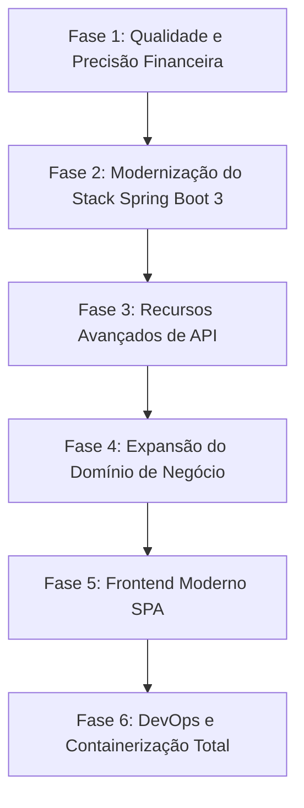

# 🚀 Roadmap de Evolução e Melhorias — Concessionária Gomez API

Documento criado em **13/09/2026** consolidando o diagnóstico atual da aplicação e o plano de evolução técnica e de negócios para guiar as próximas etapas de desenvolvimento.

---

## 📌 Status Atual do Projeto (Baseline)
- [x] **Ambiente Local:** Java 21 + MySQL 8.0 rodando isolado via Docker (`docker-compose.yml` na porta `3307`).
- [x] **Gerenciador de Banco:** DBeaver Community conectado e operacional (porta `3307`).
- [x] **Framework:** Spring Boot 2.6.2 com Maven.
- [x] **Banco & Migrations:** Flyway gerenciando scripts com carga de testes automática (`afterMigrate.sql`).
- [x] **Testes de API:** Coleção Postman validada (`concessionaria-postman-collection.json`) com fluxo CRUD completo.

---

## 🗺️ Fases Sugeridas de Evolução

---

### 🔹 Fase 1: Qualidade de Código & Precisão Financeira (Quick Wins)
- [x] **Migração de `Double`/`double` para `BigDecimal`:**
  - Substituir tipos primitivos de ponto flutuante binário por `BigDecimal` nos campos de valor (`compra` e `venda`).
  - Evitar dízimas e imprecisões contábeis no arredondamento financeiro.
  - Migration Flyway `V004__altera-compra-para-decimal.sql` adicionada.
- [x] **Extração da Regra de Negócio de Venda:**
  - Mover o cálculo da margem de 10% de `CarroModel.java` (camada de apresentação/DTO) para o domínio (`Carro.java` ou `CalculadoraMargemService`).
  - Permitir parametrização futura da margem de lucro por veículo ou categoria.
- [ ] **Revisão dos Testes de Integração:**
  - Rodar e atualizar os testes existentes em `src/test/java` com REST-Assured para garantir cobertura antes das refatorações maiores.

---

### 🔹 Fase 2: Modernização do Stack Tecnológico
- [ ] **Upgrade para Spring Boot 3.x:**
  - Migrar dependências do ecossistema `javax.*` para `jakarta.*`.
  - Habilitar suporte nativo a recursos modernos do Java 21 (incluindo *Virtual Threads* para I/O de alta concorrência).
- [ ] **Substituição do Springfox por SpringDoc (OpenAPI 3 / Swagger Moderno):**
  - Remover `springfox-swagger2` e `springfox-swagger-ui` (descontinuados).
  - Adicionar `springdoc-openapi-starter-webmvc-ui` para documentação viva e interativa em `/swagger-ui/index.html`.
- [ ] **Atualização das dependências auxiliares:**
  - ModelMapper / MapStruct e drivers atualizados no `pom.xml`.

---

### 🔹 Fase 3: Recursos Avançados de API RESTful
- [ ] **Paginação e Ordenação:**
  - Implementar suporte a `Pageable` no endpoint `GET /carros` (`?page=0&size=10&sort=compra,desc`).
  - Prevenir sobrecarga de memória caso a base cresça para milhares de veículos.
- [ ] **Filtros Dinâmicos (Search API via Spring Data JPA Specification):**
  - Permitir buscas complexas e combinadas na URL:
    - `GET /carros?marca=Ford&anoMin=2018&precoMax=100000&ativo=true`
- [ ] **Maturidade REST com HATEOAS (Richardson Nível 3):**
  - Adicionar links hipermídia nas respostas dos carros (ex.: links para self, ativação, inativação e fotos).

---

### 🔹 Fase 4: Expansão do Domínio de Negócio (Novas Entidades)
- [ ] **Módulo de Clientes:**
  - Criação da entidade `Cliente` (Nome, CPF/CNPJ, Telefone, E-mail, Endereço).
- [ ] **Módulo de Propostas / Vendas:**
  - Criação da entidade `Venda` associando `Carro`, `Cliente`, data da venda e valor final negociado.
  - Atualização automática do status do carro para "Vendido" / "Inativo para venda".
- [ ] **Upload e Armazenamento de Fotos do Veículo:**
  - Endpoint `POST /carros/{id}/foto` para upload multipart.
  - Armazenamento em diretório local ou compatível com S3 (usando MinIO no Docker).

---

### 🔹 Fase 5: Frontend Moderno (Painel do Funcionário)
- [ ] **Tecnologia recomendada: React (Vite + TypeScript) ou Angular / Vue / Tailwind CSS:**
  - Interface SPA (Single Page Application) limpa, responsiva e com visual profissional.
- [ ] **Dashboard Principal:**
  - Total de veículos em estoque, valor total investido e estimativa de faturamento com margem.
- [ ] **Grid / Catálogo Interativo com Cards:**
  - Exibição visual de cada carro (marca, modelo, ano, crachá "Ativo/Inativo", valor sugerido de venda).
  - Ações rápidas: botão de alternar ativo/inativo, editar e excluir com modal de confirmação.
- [ ] **Formulário de Cadastro/Edição:**
  - Validação de campos em tempo real com mensagens amigáveis em português (consumindo o *Problem Details* do backend).

---

### 🔹 Fase 6: DevOps & Containerização Completa
- [ ] **Dockerfile Multi-Stage para o Spring Boot:**
  - Criação do `Dockerfile` otimizado para compilar e empacotar a aplicação em imagem leve (Alpine/Distroless).
- [ ] **Docker Compose Unificado:**
  - Expandir o `docker-compose.yml` para subir a aplicação Java + Frontend + MySQL juntos em um único comando `docker compose up -d` faz tudo.
- [ ] **CI/CD Básico (GitHub Actions):**
  - Pipeline automático para compilar, rodar testes e verificar qualidade a cada push.

---

## 🛠️ Como Consultar ou Executar
Quando for iniciar uma etapa, basta abrir este arquivo no projeto (`ROADMAP.md`), escolher a tarefa e iniciamos com commits pontuais e testes a cada passo!
