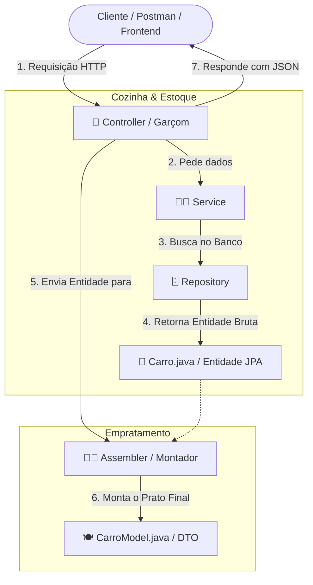
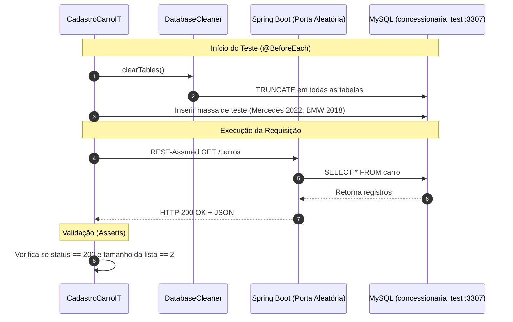

# 📚 Guia de Arquitetura, Decisões de Projeto e Conceitos — Concessionária Gomez

Este documento foi elaborado para servir como material de consulta permanente e estudo contínuo. Ele está formatado com sintaxe compatível com o **Obsidian** (incluindo *Callouts*, diagramas *Mermaid* e tabelas comparativas).

---

## 📑 Sumário
1. [Extração da Regra de Negócio de Venda (Domínio vs. DTO)](#1-extração-da-regra-de-negócio-de-venda-domínio-vs-dto)
2. [Arquitetura em Camadas: Controller, Model e Assembler](#2-arquitetura-em-camadas-controller-model-e-assembler)
3. [Roteamento HTTP no Spring: O Mistério do Erro 400 no Filtro de Ano](#3-roteamento-http-no-spring-o-mistério-do-erro-400-no-filtro-de-ano)
4. [Testes de Integração com REST-Assured e a Classe CadastroCarroIT](#4-testes-de-integração-com-rest-assured-e-a-classe-cadastrocarroit)

---

## 1. Extração da Regra de Negócio de Venda (Domínio vs. DTO)

### 📌 O Cenário Original
Anteriormente, o cálculo da margem de lucro de 10% da concessionária estava implementado dentro do getter de uma classe DTO (`CarroModel.java`):

```java
// ❌ ANTES: api/model/CarroModel.java (camada de apresentação)
public BigDecimal getVenda() {
    if (this.compra == null) return null;
    return this.compra.multiply(new BigDecimal("1.10")).setScale(2, RoundingMode.HALF_UP);
}
```

### ❓ Por que decidimos extrair essa regra?

> [!IMPORTANT]
> **O Princípio da Responsabilidade Única (SRP)**  
> Um DTO (*Data Transfer Object*) deve servir **apenas para transportar dados** entre a API e quem a consome. Ele não deve ter inteligência financeira nem ditar políticas da empresa.

As 4 razões fundamentais para a mudança:
1. **Domínio Cego:** Se amanhã um serviço de contratos, um relatório gerencial ou um futuro módulo de emissão de NF precisasse saber o valor sugerido de venda de um carro, ele não teria acesso a essa informação, pois a entidade `Carro` não sabia calculá-la — apenas o DTO visual sabia.
2. **Acoplamento Indesejado:** Obriga o backend a instanciar classes da camada Web/REST para fazer cálculos internos.
3. **Rigidez de Negócio:** Fixar o valor `"1.10"` dentro do DTO impedia margens dinâmicas (por categoria de veículo, tempo de estoque ou promoções).
4. **Testabilidade:** Regras financeiras no domínio podem ser testadas com testes unitários em milissegundos sem precisar de serializador Jackson ou Spring Web.

### ✅ A Solução Implementada (Rich Domain Model)
Movemos a regra para a entidade de negócio [`Carro.java`](file:///C:/Projetos/concessionaria/src/main/java/com/concessionaria/gomez/domain/model/Carro.java):

```java
// ✅ DEPOIS: domain/model/Carro.java (camada de domínio)
public static final BigDecimal MARGEM_LUCRO_PADRAO = new BigDecimal("0.10");

public BigDecimal calcularPrecoVendaSugerido() {
    return calcularPrecoVendaSugerido(MARGEM_LUCRO_PADRAO);
}

public BigDecimal calcularPrecoVendaSugerido(BigDecimal percentualMargem) {
    if (this.compra == null) return null;
    if (percentualMargem == null) percentualMargem = MARGEM_LUCRO_PADRAO;
    
    BigDecimal multiplicador = BigDecimal.ONE.add(percentualMargem);
    return this.compra.multiply(multiplicador).setScale(2, RoundingMode.HALF_UP);
}
```

---

## 2. Arquitetura em Camadas: Controller, Model e Assembler

Para entender como essas peças conversam, usamos a **Metáfora do Restaurante**:



### 🔍 Papéis Detalhados:

| Componente | Quem é na metáfora? | Pacote | Responsabilidade |
| :--- | :--- | :--- | :--- |
| **`CarroController`** | 🤵 **O Garçom** | `api.controller` | Atende o cliente externo, recebe a requisição HTTP (`GET`, `POST`), coordena a chamada aos serviços e devolve o status HTTP correto (`200`, `201`, `404`). **Não calcula nada nem fala direto com o banco.** |
| **`Carro`** *(Entity)* | 🥩 **O Ingrediente Bruto** | `domain.model` | Representa a tabela física no banco MySQL. Possui as anotações JPA (`@Entity`, `@Column`) e guarda as regras vitais do negócio. Não deve ser exposto diretamente na internet para não vazar a estrutura do banco. |
| **`CarroModel`** *(DTO)* | 🍽️ **O Prato Decorado** | `api.model` | Define a "cara" do JSON devolvido ao usuário. Contém apenas os dados que o cliente tem permissão e interesse em ver. |
| **`CarroModelAssembler`**| 👨‍🍳 **O Chef Empratador** | `api.assembler` | Pega o `Carro` do banco e transforma no `CarroModel` pronto para servir, inserindo o cálculo de venda do domínio. |
| **`CarroInputDisassembler`** | 📦 **O Conferente de Carga** | `api.assembler` | Faz o caminho inverso: pega o JSON enviado pelo cliente no `POST`/`PUT` e o transforma na entidade `Carro` para ser salva. |

---

## 3. Roteamento HTTP no Spring: O Mistério do Erro 400 no Filtro de Ano

### 🚨 O Problema
Ao tentar buscar carros filtrando por ano através da URL:
```http
GET http://localhost:8080/carros/ano?ano=2007
```
O servidor retornava **HTTP 400 Bad Request**, mesmo existindo carros com o ano 2007 no banco.

### 🕵️ Por que o erro 400 acontecia?
No Spring MVC, tínhamos no controller apenas estas duas rotas `GET`:
1. `@GetMapping` ➔ `/carros` (listar todos)
2. `@GetMapping("/{carroId}")` ➔ `/carros/{carroId}` (buscar por id numérico `Long`)

Quando a URL `/carros/ano?ano=2007` foi chamada:
1. O Spring não encontrou nenhum método mapeado expressamente para a rota estática `/carros/ano`.
2. Por eliminação, ele assumiu que o trecho `/ano` era a variável de caminho do segundo método: `{carroId}`.
3. O Spring tentou converter o texto `"ano"` para o tipo `Long carroId`.
4. Obviamente, a palavra `"ano"` não é um número inteiro ➔ ocorreu a exceção interna `MethodArgumentTypeMismatchException`, resultando no status **400 Bad Request**.

### 💡 A Solução Correta (Padrão RESTful)
Nas boas práticas de API REST, filtros não são sub-recursos (não devem criar subcaminhos na URL), mas sim **parâmetros de consulta** (*Query Parameters*) na própria coleção:

```http
GET http://localhost:8080/carros?ano=2007
```

No [`CarroController.java`](file:///C:/Projetos/concessionaria/src/main/java/com/concessionaria/gomez/api/controller/CarroController.java):
```java
@GetMapping
public List<CarroModel> listar(@RequestParam(required = false) Integer ano) {
    List<Carro> carros = (ano != null) 
            ? carroRepository.findByAno(ano) 
            : carroRepository.findAll();
            
    return carroModelAssembler.toCollectionModel(carros);
}
```
- Se o parâmetro `ano` for informado, filtra.
- Se for omitido (`GET /carros`), retorna todos normalmente.

---

## 4. Testes de Integração com REST-Assured e a Classe CadastroCarroIT

### 🤖 O que é a classe `CadastroCarroIT.java`?
O sufixo **`IT`** significa **Integration Test**. Essa classe não testa apenas funções Java isoladas: ela sobe a aplicação inteira em memória, conecta no banco MySQL e simula requisições reais exatamente como o Postman ou um usuário fariam.



### 🛡️ Por que revisar esses testes antes da Fase 2 (Spring Boot 3)?

A migração de versão do framework (Spring Boot 2.6 ➔ 3.x) traz mudanças gigantescas:
- Pacotes `javax.*` mudam para `jakarta.*`.
- Atualização do motor Hibernate 5 para Hibernate 6 (mudança em geração de SQL e tratamento de datas `OffsetDateTime`).
- Substituição da biblioteca de documentação de Swagger.

> [!WARNING]
> Sem uma suíte de testes de integração cobrindo cada verbo HTTP (`GET`, `POST`, `PUT`, `DELETE`), ativação, inativação e validações de erro, qualquer falha sutil no upgrade passaria despercebida até explodir em produção. Os testes de integração são o nosso **cinto de segurança**.

### 🧩 Componentes-Chave do Teste Explicados:
1. **`webEnvironment = RANDOM_PORT`:** Sobe o servidor web em uma porta livre qualquer, permitindo rodar os testes sem dar conflito com a porta `8080`.
2. **`@TestPropertySource("/application-test.properties")`:** Aponta para um banco separado chamado `concessionaria_test`, garantindo que os testes **nunca apaguem dados do seu banco de desenvolvimento**.
3. **`DatabaseCleaner`:** Executa um script SQL antes de cada teste para resetar as tabelas, mantendo cada teste 100% independente dos outros.
4. **`REST-Assured`:** A biblioteca fluente em Java que envia requisições HTTP e valida códigos de resposta, cabeçalhos e corpos JSON em poucas linhas de código.
